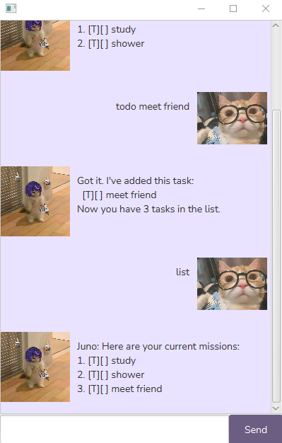

# Juno User Guide :yum:

Juno is your personal chatbot designed to help you manage tasks and expenses efficiently. Whether you're looking to organize your to-do list, set deadlines, schedule events, or track your expenses, Juno makes it simple with easy-to-use commands.

## Features
Task Management
Juno offers a variety of commands to help you manage your tasks effectively. You can add, delete, and monitor tasks, deadlines, and events with ease.

- List Commands:
    `help` - Shows a list of all supported commands. 
- View To-Do List:
    `list` - View your current to-do list.
- Add a To-Do Task: 
    `todo <task name>` - Adds a new task to your to-do list.
- Add a Deadline Task:
    `deadline <task name> /by <deadline>` - Adds a task with a specified deadline.
- Add an Event: 
    `event <task name> /from <event start> /to <event end>` - Adds an event with a start and end date.
    Example: `event travel to japan /from 2025-02-27 /to 2025-03-07`
- Mark a Task as Complete:
    `mark <task number>` - Mark the task at the specified index as complete.
- Find Tasks by Keyword:
    `find <keywords>` - Searches for tasks that match the provided keyword(s).
    Example: `find travel`
- Unmark a Task:
    `unmark <task number>` - Unmarks the task at the specified index.
- Delete a Task:
    `delete <task number>` - Deletes the task at the specified index.

## Examples of Commands and Expected Output

Adding a To-Do Task
Command: `todo Read a book`
Expected Output:
`Got it. I've added this task:`
`[T][ ] Read a book`
`Now you have 1 task in the list.`

Marking a Task as Done
Command: `mark 1`
Expected Output:
`Nice! I've marked this task as done:`
`[T][X] Read a book`
